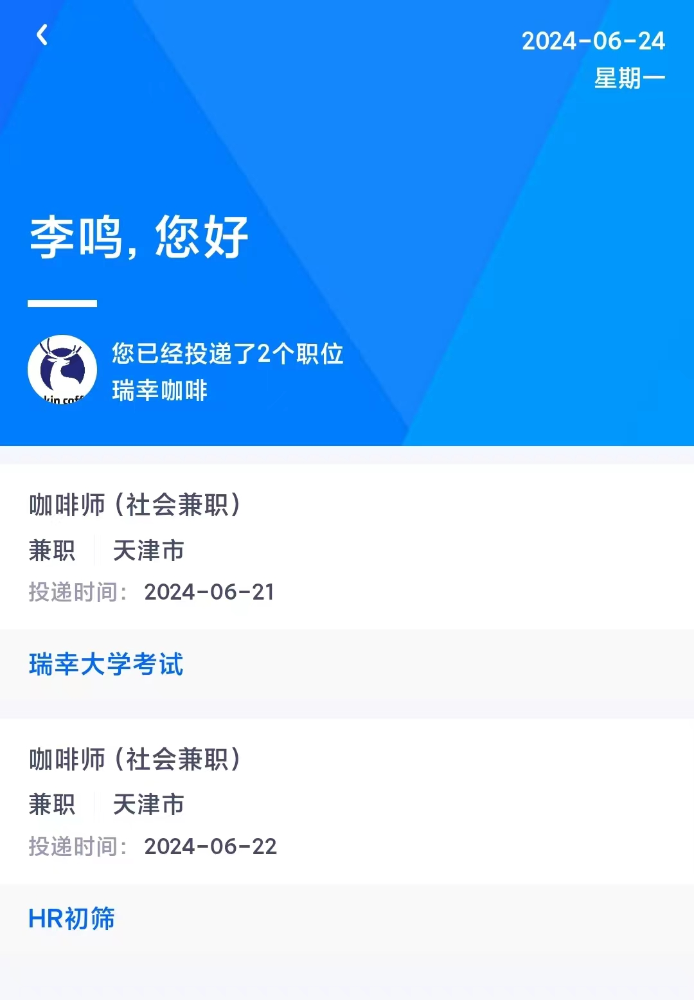

# 重生之我在瑞幸咖啡做咖啡师

~~这一世我重生了，在瑞星咖啡做咖啡师，发誓要……~~

---

### 寻找门店

从BOSS找瑞星的劳务的HR交换了微信联系方式，HR提供一份附近缺人的瑞幸门店名单，然后约定在6月21日（周五）上午十点进行岗位介绍。岗位介绍后是帮助求职者入职。

21日上午听完他们的岗位介绍后，我误以为他们这种“兼职加”的方式会有薪资抽成，所以上午听完直接去锁定了一家劳务的门店名单直接WalkIn门店去问。

劳务的提供的缺人的门店是可靠的，我也去WalkIn相应门店确认了确实缺人，但有些门店会介意两个月短期兼职的。

我是通过发布小红书求助帖，得到附近瑞幸门店的店员提供的店长联系方式，联系了店长然后约到第二天面试，主要是说了岗位大概情况，**天津本地健康证要有、工作衣服要自己买**，也问你有无从业经验，我都谎称做过火锅店的前台收银，对方也不深究，总体感觉面试没什么难度，然后如果有意向可以通过微信公众号“瑞幸咖啡招聘”上投简历，投递当晚就被业务部门确认（店长确认）。

当天傍晚收到另外一家约我明天面试，第二天也很顺利的得到另外一家店长的认可，但是一个简历进入流程后，另外一个简历就会被卡在HR初筛。第二家的店长很关心我的流程，我说明了这个两个流程冲突的问题，她让我选门店，如果选她的门店要找第一家店长协商。

我很喜欢第二家的店长，但是考虑沟通以及面临入职流程可能重新开始，不想再拖延时间，我找第一家店长确定她在为我办入职流程，还是选择了第一家。

健康证22去面试第二家瑞幸前去“铭华医院”办理的，可以不带身份证，但是现场采集照片因为背光会很黑，我是自己手机打光才不那么黑，主要就是四项：采血、采便（菊部非常不适）、内可检查、X光检查。四天后也就是25日，依靠凭证领取到了健康证。工服40多拼xx就能买。

### 漫长入职路

截至到今日7月1日，我至今没有进行门店的工作。

期间经历了：

- 线上学习：瑞幸公司的介绍、工作岗位的介绍、十大热门配方介绍；
- 一天的线下集中培训（本来线下，因为装修改在线上）：瑞幸天津分公司负责培训，涵盖天津、石家庄、青岛等。全面讲述了企业发展、企业文化、规章制度、工作流程、食品安全、薪资待遇、职场发展等；
- 继续线上学习：深入学习，涵盖了一些职场技能；

门店确认后的下一周的周一，会有邮箱通知让你更新一下简历，这里面包含了是否有瑞幸的工作经验，填写自己的英文名。更新完后，当天上午邮箱通知下载“瑞幸大学”，然后下午邮箱告知手机作为用户名的账户已经开通，需要完成“职前学习计划-20230208（Z）”的培训，完成这个培训后，线上的招聘状态就会进入“创建Offer”。

我选择的这个门店距离天津大学近，门店店长告诉我门店带训的很多，本来找她报名线下集中培训她不太了愿意让我太早参加，最后我和她说我想参加，她才让我参加的，不然就要再等一周才能参加这个线下集中培训，进度又会被拖慢一周。

线下集中培训会点名、提问、记分（不知道干什么用的）、给铭牌。一天讲完之后会将“瑞幸大学”的账号从手机号更改为工号，然后同时给我们开放“瑞幸工作站”、“瑞幸OA”的账号，同时在当天培训尾声会在“瑞幸大学”发布一个“天津分公司-新员工培训Z-20240604（兼职）”的培训项目，该项目包含了从线下集中培训到最后值班主管的总流程，线下培训的考试需要当天培训结束前考完，这个小红书能找到答案，难度不大，但是限制重考次数。再到后面需要练习店长帮忙设计训练计划，然后再瑞幸大学上提交，这个期间我从练习店长到店长设计好主动联系我用了三天时间。但是按照店长说不会排这么满，因为门店带训的人太多了，但是未来一周会给我排班。

下述为线上入职状态的跟踪：

| 状态         | 描述                                     | 触发条件                                                     |
| ------------ | ---------------------------------------- | ------------------------------------------------------------ |
| HR初筛       | 总部筛选简历                             | 线上投递简历后立刻进入该状态                                 |
| 业务部门筛选 |                                          | HR初筛通过后进入该状态                                       |
| 业务部门确认 |                                          | 门店店长确认后进入该状态                                     |
| 更新简历     | 补充自己是否有瑞幸工作经验，自己的英文名 | 我这边上周五业务部门确认，这周一进入这个状态 （可能是周一统一审核） |
| 瑞幸大学考试 | 邮件通知面试通过，进入职前学习与考试阶段 | 更新简历后立刻进入该状态 第一封邮件告知考试，第二封邮件表明账号创建成功，可以考试 |
| 创建Offer    |                                          | 通过瑞幸大学职前学习与考试后立刻进入该状态                   |
| 沟通Offer    |                                          | 联系店长报名线下集中培训，报名成功后进入该状态               |

